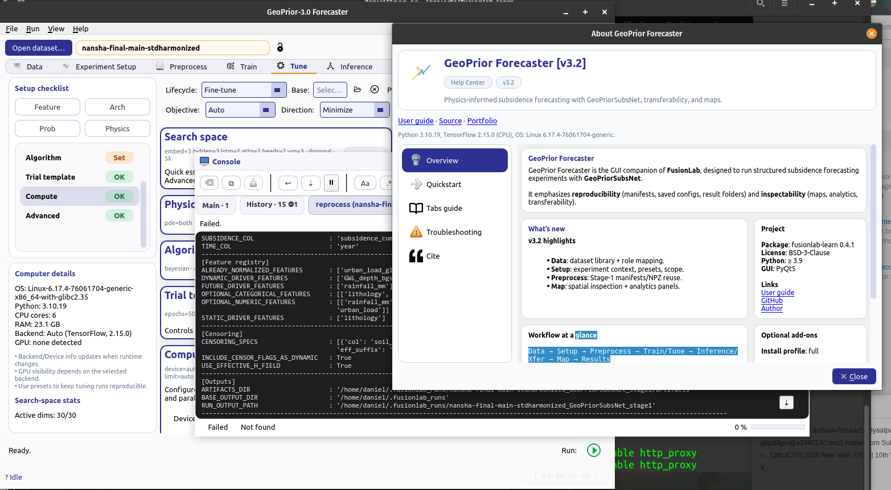

<div align="center">


<br>

<h1>GeoPrior-v3 (GeoPriorSubsNet)</h1>

<p>
  Physics-guided AI for geohazard forecasting & risk analytics<br>
  <em>Code Ocean reproducibility capsule</em>
</p>

<p>
  <a href="https://github.com/earthai-tech/geoprior-v3">
    GitHub: earthai-tech/geoprior-v3
  </a>
  &nbsp;•&nbsp;
  <a href="https://fusion-lab.readthedocs.io/en/latest/user_guide/models/pinn/geoprior/index.html">
    User guide (temporary)
  </a>
</p>

</div>

---

## Overview

This capsule provides an end-to-end, reproducible implementation of
**GeoPriorSubsNet (GeoPrior-v3)** — a physics-informed deep learning
framework for **urban land subsidence forecasting** that couples an
attentive spatio-temporal backbone to a reduced consolidation model and
a closure-consistent mapping between inferred hydrogeological fields and
the emergent relaxation timescale.

**Today:** land subsidence (GeoPriorSubsNet).  
**Next:** landslides and broader geohazard regimes (GeoPrior roadmap).

---

## Manuscript (how to cite)

If you use this capsule, please cite:

```bibtex
@unpublished{kouadio_geopriorsubsnet_nature_2025,
  author  = {Kouadio, Kouao Laurent and Liu, Rong and Jiang, Shiyu and
             Liu, Zhuo and Kouamelan, Serge and Liu, Wenxiang and
             Qing, Zhanhui and Zheng, Zhiwen},
  title   = {Physics-Informed Deep Learning Reveals Divergent Urban Land Subsidence Regimes},
  journal = {Nature Communications},
  note    = {Submitted},
  year    = {2025}
}
````

---

## What is included in this capsule?

**Included**

* GeoPrior-v3 source code required to reproduce the paper runs
  (model, training, evaluation, plotting, exports).
* Reproducibility scripts (pipeline stages; see below).
* Physics-audit exports (e.g., closure consistency and residual payloads).
* Tuning utility: **`SubsNetTuner`** (hyperparameter search for GeoPriorSubsNet).

**Not included (by design)**

* The **GeoPrior GUI application code** (premium/private).
  This capsule only demonstrates that the app exists.

---

## GeoPrior GUI (not included, preview only)

A GUI preview image is provided here:

<p align="center">
  
</p>

Tutorial videos:

* App tutorial: [https://youtu.be/JtOpX5lv4iw](https://youtu.be/JtOpX5lv4iw)
* Example simulation run: [https://youtu.be/nCouLQQFpQg](https://youtu.be/nCouLQQFpQg)

---

## Repository structure (capsule)

This capsule follows a staged workflow. The exact filenames may evolve,
but the intent is stable:

* `nat.com/config.py`
  Central configuration for reproducibility (paths, seeds, defaults).

* `nat.com/stage1.py`
  Data harmonisation + feature construction + tensor packaging.

* `nat.com/stage2.py`
  Training GeoPriorSubsNet (physics + data objectives).

* `nat.com/stage5.py`
  Transfer / warm-start experiments (cross-city adaptation).

Outputs are written under `./outputs/` (models, logs, figures, metrics,
payload exports).

---

## Input data (CSV contract)

### Where the CSV files must live

The Stage-1 pipeline searches for the city CSV using multiple locations,
including `./data/<BIG_FN>` from the repository root. 

For this capsule, place the harmonized city datasets here:

- `data/nansha_final_main_std.harmonized.cleaned.with_zsurf.csv`
- `data/zhongshan_final_main_std.harmonized.cleaned.with_zsurf.csv`

These filenames follow the configured template:

- `DATASET_VARIANT = "with_zsurf"`
- `BIG_FN_TEMPLATE = "{city}_final_main_std.harmonized.cleaned.{variant}.csv"` 

> Note: The full processed datasets used in the paper are not stored in
> GitHub because they are large. They are provided in the Code Ocean
> capsule and/or made available through the corresponding data providers.

### Required columns (minimum)

Stage-1 expects a harmonized CSV that contains (at minimum) the following
core fields (names are configured in `nat.com/config.py`):

- `year` (time index)
- `longitude`, `latitude` (coordinates)
- `subsidence_cum` (target)
- `GWL_depth_bgs_m` (groundwater, depth below ground surface)
- `soil_thickness` (H-field proxy for GeoPrior physics)
- `z_surf_m` (surface elevation used to construct head consistently)
- `head_m` (hydraulic head, used when available) 

### Optional drivers used in the paper runs

If present, GeoPrior-v3 will automatically use:

- Numeric drivers: `rainfall_mm`, `urban_load_global`
- Categorical/static features: `lithology`, `lithology_class` 

These match the processed dataset schema used for the paper.

### Switching city

To switch between cities, edit:

- `CITY_NAME = "nansha"` → `"zhongshan"` 

Stage-1 will then resolve the correct `BIG_FN` from the template and
search for the corresponding file.

---
## Quick start (reproduce a full run)


### 0) Install / import (inside Code Ocean)

In many capsules, the environment is already provisioned.
If you need an editable install:

```bash
python -m pip install -e .
```

### 1) (Optional) Configure log directory

GeoPrior supports `${LOG_PATH}` substitution in YAML logging configs.
Recommended for Code Ocean (clean, user-scoped):

```bash
export GEOPRIOR_LOG_PATH="$HOME/.geoprior/logs"
mkdir -p "$GEOPRIOR_LOG_PATH"
```

### 2) Stage 1 — data preparation

```bash
python nat.com/stage1.py --help
python nat.com/stage1.py
```

### 3) Stage 2 — train GeoPriorSubsNet

```bash
python nat.com/stage2.py --help
python nat.com/stage2.py
```

### 4) Stage 5 — transfer experiments (optional)

```bash
python nat.com/stage5.py --help
python nat.com/stage5.py
```

---

## Hyperparameter tuning (SubsNetTuner)

GeoPrior includes a tuner specialized for **GeoPriorSubsNet**:
`SubsNetTuner` (implemented in `_geoprior_tuner.py` and re-exported by
`tuners.py`).

Example pattern (Python):

```python
from geoprior.models.tuners import SubsNetTuner

fixed = {"forecast_horizon": 3}
space = {
    "embed_dim": [32, 64],
    "num_heads": [2, 4],
    "dropout_rate": {"type": "float", "min_value": 0.1, "max_value": 0.3},
    "learning_rate": [1e-3, 5e-4],
    "lambda_gw": {"type": "float", "min_value": 0.5, "max_value": 1.5},
}

tuner = SubsNetTuner.create(
    inputs_data=inputs_np,
    targets_data=targets_np,
    search_space=space,
    fixed_params=fixed,
    max_trials=20,
    project_name="GeoPrior_HP_Search",
)

best_model, best_hps, kt = tuner.run(
    inputs=inputs_np,
    y=targets_np,
    validation_data=(val_inputs_np, val_targets_np),
    epochs=30,
    batch_size=32,
)
```

---

## Outputs (what to look for)

After running stages, check `./outputs/` for:

* `outputs/models/`
  Saved weights / checkpoints.

* `outputs/figures/`
  Paper-style and diagnostic plots.

* `outputs/metrics/`
  Deterministic and probabilistic evaluation summaries.

* `outputs/payloads/`
  Physics-audit payload exports (closure, residuals, learned fields).

* `outputs/logs/` (or `$GEOPRIOR_LOG_PATH`)
  Structured run logs.

---

## Notes on data conventions

The workflow uses an **annual grid** and a harmonized driver set.
The manuscript’s experiments use a look-back window `L=5` years and a
forecast horizon `H=3` years, but the pipeline is configurable in
`nat.com/config.py`.

---

## Documentation

Documentation is in active development.

* Current (temporary) user guide:
  [https://fusion-lab.readthedocs.io/en/latest/user_guide/models/pinn/geoprior/index.html](https://fusion-lab.readthedocs.io/en/latest/user_guide/models/pinn/geoprior/index.html)

A dedicated documentation site will be added later for GeoPrior-v3.

---

## License

GeoPrior-v3 is distributed under **Apache License 2.0**.
Some files may be adapted from other earthai-tech repositories and keep
their original license headers where required.

---

## Contact

**Laurent Kouadio**
Website: [https://lkouadio.com](https://lkouadio.com)
Email: [etanoyau@gmail.com](mailto:etanoyau@gmail.com)


