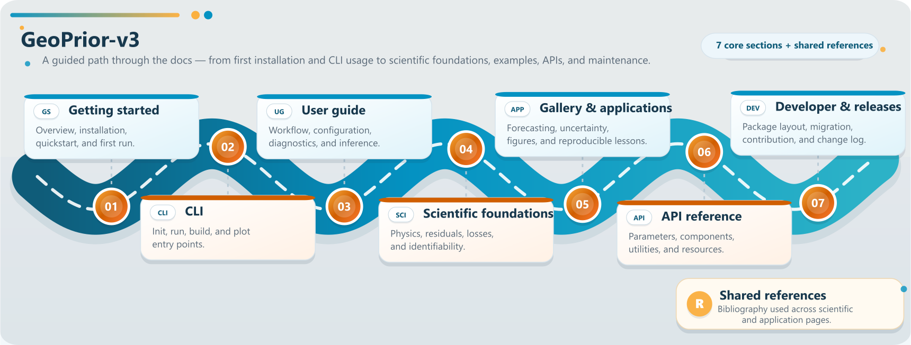

.. _home:

GeoPrior-v3
===========

.. rst-class:: hero-tagline

Physics-guided AI for geohazards and risk analytics.

GeoPrior-v3 is a scientific Python framework for building
physics-guided models for geohazard analysis, forecasting, and
risk-oriented interpretation. The current generation focuses on
**land subsidence** through **GeoPriorSubsNet v3**, while the broader
roadmap extends toward **landslides and other geohazard modeling
tasks**. The project combines scientific modeling,
configuration-driven workflows, staged CLI execution, and
reproducible figure generation in a single documentation space.

.. note::

   GeoPrior-v3 provides both a Python package interface and a
   command-line workflow. The project exposes dedicated CLI
   entry points for initialization, staged runs, builds, and
   plotting, including ``geoprior``, ``geoprior-run``,
   ``geoprior-build``, ``geoprior-plot``, and
   ``geoprior-init``. See :doc:`cli/index`  for the full
   command reference.

Start here
----------

.. grid:: 1 1 2 3
   :gutter: 3
   :class-container: cta-tiles featured-app-tiles

   .. grid-item-card:: Getting started
      :link: getting_started/index
      :link-type: doc
      :img-top: _static/icons/getting-started-icon-rocket-takeoff.svg
      :class-card: card--workflow sd-text-center

      Begin with the project overview, installation guidance,
      quickstart usage, and a first end-to-end run.

   .. grid-item-card:: User guide
      :link: user_guide/index
      :link-type: doc
      :img-top: _static/icons/user-guide-icon-book.svg
      :class-card: card--configuration sd-text-center

      Follow the staged workflow, command-line logic,
      diagnostics, inference paths, and export-oriented use.

   .. grid-item-card:: CLI
      :link: cli/index
      :link-type: doc
      :img-top: _static/icons/cli-icon-terminal.svg
      :class-card: card--cli sd-text-center

      Find run, build, and plot commands, shared conventions,
      command families, and the main command-line entry points.

   .. grid-item-card:: Scientific foundations
      :link: scientific_foundations/index
      :link-type: doc
      :img-top: _static/icons/scientific-foundations-icon-beaker.svg
      :class-card: card--physics sd-text-center

      Understand the model family, the physical formulation,
      residual construction, scaling strategy, and the main
      scientific assumptions.

   .. grid-item-card:: Gallery
      :link: examples/index
      :link-type: doc
      :img-top: _static/icons/gallery-icon-images.svg
      :class-card: card--workflow sd-text-center

      Browse lesson-style examples for forecasting, uncertainty,
      diagnostics, applications, figure generation, table builders,
      and model-inspection utilities.

   .. grid-item-card:: API reference
      :link: api/index
      :link-type: doc
      :img-top: _static/icons/api-reference-icon-braces.svg
      :class-card: card--cli sd-text-center

      Browse the documented Python interfaces for parameters,
      CLI modules, subsidence components, tuners, utilities,
      and packaged resources.
     
Roadmap
-------

Featured applications
---------------------

.. grid:: 1 1 2 3
   :gutter: 3
   :class-container: see-also-tiles featured-app-tiles

   .. grid-item-card:: Applications
      :link: applications/index
      :link-type: doc
      :img-top: _static/icons/applications.svg
      :class-card: sd-shadow-sm seealso-card card--workflow sd-text-center

      Explore workflow-oriented application pages together with
      case-study examples that show how GeoPrior is used in practice.

   .. grid-item-card:: Core & ablation
      :link: auto_examples/applications/app_core_ablation
      :link-type: doc
      :img-top: _static/icons/core-ablation.svg
      :class-card: sd-shadow-sm seealso-card card--core-ablation sd-text-center

      See how the physics-guided pathway changes forecast accuracy,
      uncertainty quality, and interpretation under a controlled
      with-physics versus no-physics comparison.

   .. grid-item-card:: Interpretation guardrails
      :link: auto_examples/applications/app_bounds_ridge
      :link-type: doc
      :img-top: _static/icons/bounds-vs-ridge-summary.svg
      :class-card: sd-shadow-sm seealso-card card--ridge-bounds

      Audit identifiability before reading learned fields literally,
      using ridge and bounds diagnostics to separate stable structure
      from non-unique decomposition.

   .. grid-item-card:: External validation
      :link: auto_examples/applications/app_external_validation
      :link-type: doc
      :img-top: _static/icons/external-validation.svg
      :class-card: sd-shadow-sm seealso-card card--physics sd-text-center

      Check how independent borehole and pumping-test evidence anchors
      the thickness pathway and clarifies what can, and cannot, be
      claimed from the inferred effective fields.

   .. grid-item-card:: Where to act first
      :link: auto_examples/applications/app_hotspot_prioritization
      :link-type: doc
      :img-top: _static/icons/where-to-act-first.svg
      :class-card: sd-shadow-sm seealso-card card--hotspot-analytics sd-text-center

      Turn calibrated forecasts into exceedance maps, ranked hotspot
      clusters, and persistence-based intervention priorities.

   .. grid-item-card:: Cross-city rollout
      :link: auto_examples/applications/app_transferability
      :link-type: doc
      :img-top: _static/icons/transferability.svg
      :class-card: sd-shadow-sm seealso-card card--workflow sd-text-center

      Compare baseline, zero-shot transfer, and warm-start adaptation
      to see what survives distribution shift and what level of local
      adaptation is needed before deployment.
      

Reference and project notes
---------------------------

.. grid:: 1 1 2 3
   :gutter: 3
   :class-container: cta-tiles featured-app-tiles

   .. grid-item-card:: Glossary
      :link: glossary/index
      :link-type: doc
      :img-top: _static/icons/glossary-icon-book.svg
      :class-card: card--configuration sd-text-center

      Look up core symbols, abbreviations, workflow terms, and
      recurring scientific language used throughout the documentation.

   .. grid-item-card:: Developer notes
      :link: developer/index
      :link-type: doc
      :img-top: _static/icons/developer-notes-icon-tools.svg
      :class-card: card--configuration sd-text-center

      See package layout, migration notes, and contribution
      guidance for maintaining and extending GeoPrior-v3.

   .. grid-item-card:: Release notes
      :link: release_notes
      :link-type: doc
      :img-top: _static/icons/release-notes-icon-clock-history.svg
      :class-card: card--workflow sd-text-center

      Track user-visible changes across versions, including
      workflow, API, scientific, and documentation updates.
      

 
Why GeoPrior-v3?
----------------

.. grid:: 1 1 2 2
   :gutter: 3

   .. grid-item-card:: Physics-guided by design
      :class-card: sd-border-1 sd-shadow-sm

      GeoPrior-v3 is built around physics-aware modeling
      rather than purely black-box forecasting. The platform
      emphasizes scientifically interpretable learning for
      subsidence analysis and broader geohazard settings.

   .. grid-item-card:: Workflow-oriented
      :class-card: sd-border-1 sd-shadow-sm

      The documentation is organized around how the project is
      actually used: initialization, staged execution,
      configuration, diagnostics, inference, plotting, and
      reproducible scientific outputs.

   .. grid-item-card:: Built for applications
      :class-card: sd-border-1 sd-shadow-sm

      The project is not only an API library. It is also an
      application framework with dedicated command-line entry
      points and figure-generation scripts for research and
      reporting pipelines.

   .. grid-item-card:: Structured for growth
      :class-card: sd-border-1 sd-shadow-sm

      The current flagship application is land subsidence,
      but the framework is positioned to expand toward broader
      geohazard workflows and future physics-guided hazard
      modeling tasks.

Start in one minute
-------------------

Install GeoPrior-v3 once, then choose how you want to start.

.. code-block:: bash

   pip install geoprior-v3

.. grid:: 1 1 2 3
   :gutter: 3
   :class-container: quickstart-grid

   .. grid-item-card::
      :link: api/index
      :link-type: doc
      :class-card: quickstart-card sd-text-center

      .. image:: _static/icons/quickstart-python.svg
         :alt: Python API icon
         :class: quickstart-icon
         :width: 64px
         :align: center

      **Python API**

      Build workflows in notebooks and Python scripts.

      :doc:`Open the API guide <api/index>`

   .. grid-item-card::
      :link: cli/index
      :link-type: doc
      :class-card: quickstart-card sd-text-center

      .. image:: _static/icons/quickstart-cli.svg
         :alt: CLI workflow icon
         :class: quickstart-icon
         :width: 64px
         :align: center

      **CLI workflow**

      Run staged pipelines, builds, and plotting from the terminal.

      :doc:`Open the CLI guide <cli/index>`

   .. grid-item-card::
      :link: examples/index
      :link-type: doc
      :class-card: quickstart-card sd-text-center

      .. image:: _static/icons/quickstart-examples.svg
         :alt: Examples gallery icon
         :class: quickstart-icon
         :width: 64px
         :align: center

      **Learn by examples**

      Start from gallery lessons for forecasting, uncertainty,
      diagnostics, and figure generation.

      :doc:`Open the examples gallery <examples/index>`

.. container:: quickstart-helper

   **Need project setup first?**
   Create the working configuration used by staged CLI runs with
   ``geoprior-init``.

   .. code-block:: bash

      geoprior-init --help

Navigate directly
-----------------

.. grid:: 1 1 2 3
   :gutter: 3

   .. grid-item::
      .. button-ref:: getting_started/index
         :ref-type: doc
         :color: primary
         :expand:

         Begin with getting started

   .. grid-item::
      .. button-ref:: user_guide/index
         :ref-type: doc
         :color: secondary
         :expand:

         Open the user guide

   .. grid-item::
      .. button-ref:: cli/index
         :ref-type: doc
         :color: primary
         :expand:

         Explore the CLI reference

   .. grid-item::
      .. button-ref:: applications/index
         :ref-type: doc
         :color: secondary
         :expand:

         See the application workflows

   .. grid-item::
      .. button-ref:: examples/index
         :ref-type: doc
         :color: primary
         :expand:

         Browse gallery examples

   .. grid-item::
      .. button-ref:: scientific_foundations/index
         :ref-type: doc
         :color: secondary
         :expand:

         Explore the models and physics

   .. grid-item::
      .. button-ref:: api/index
         :ref-type: doc
         :color: primary
         :expand:

         Browse the API reference

   .. grid-item::
      .. button-ref:: developer/index
         :ref-type: doc
         :color: secondary
         :expand:

         Open developer notes

   .. grid-item::
      .. button-ref:: release_notes
         :ref-type: doc
         :color: primary
         :expand:

         View release notes

   .. grid-item::
      .. button-ref:: glossary/index
         :ref-type: doc
         :color: secondary
         :expand:

         Open the glossary

   .. grid-item::
      .. button-ref:: scientific_scope
         :ref-type: doc
         :color: primary
         :expand:

         Understand the scientific scope
         
   .. grid-item::
      .. button-ref:: references
         :ref-type: doc
         :color: secondary
         :expand:

         See shared references

.. toctree::
   :hidden:
   :maxdepth: 1
   :titlesonly:

   getting_started/index
   user_guide/index
   cli/index
   applications/index
   examples/index
   scientific_foundations/index
   api/index
   developer/index
   release_notes
   glossary/index
   scientific_scope
   references